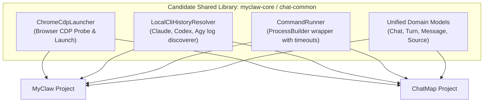
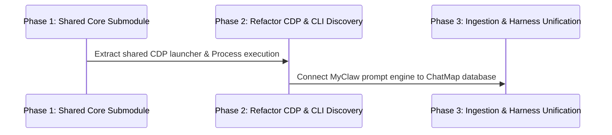

# Architectural Analysis & Refactoring Roadmap: ChatMap & MyClaw

> [!NOTE]
> This analysis presents a deep structural evaluation of **MyClaw** (`rtayek/myclaw`) and **ChatMap** (`rtayek/chatmap` / `cjatmanager`). It identifies candidate shared components, code smells, and actionable refactoring opportunities.

---

## 1. Executive Summary

| Project | Primary Domain / Role | UI Technology | Storage Model | Key Capabilities |
| :--- | :--- | :--- | :--- | :--- |
| **MyClaw** (`myclaw`) | Prompt Harness & Execution Engine | Java Swing (`FlatLaf`) | SQLite Event Store (`session_events`) | Direct prompt execution (Claude, Codex, Agy, Ollama), Event-sourced sessions, CDP Web Adapter |
| **ChatMap** (`cjatmanager`) | Chat Ingestion, Mapping, Graphing & Consolidation | JavaFX 21 (`ChatMapApp`) | Relational SQLite (`chats`, `messages`, `tags`) | Multi-source ingestion (Archive ZIP, Markdown, Web, CLI), Graph visualization, Auto-summarization & tagging, Project consolidation |

---

## 2. Common Code & Extraction Candidates

### High-Priority Extraction Candidates

1. **Chrome CDP Launcher (`ChromeCdpLauncher.java`)**
   - **Current State**: ~95% code duplication between `myclaw.web.ChromeCdpLauncher` and `chatmap.backend.ChromeCdpLauncher`.
   - **Extraction Benefit**: Centralizes Chrome binary resolution across Windows/macOS/Linux, `--remote-debugging-port` probing on `127.0.0.1:9222`, and timeout handling into a single reusable utility module.

2. **LLM CLI Session & History Discovery**
   - **Current State**: `myclaw.application.TranscriptIngestionService` and `chatmap.backend.LocalCliSessions` (along with `ClaudeCodeHistoryProvider`, `CodexCliHistoryProvider`, `GeminiCliHistoryProvider`) duplicate session scanning and JSONL parsing for local CLI logs (`~/.claude/`, `~/.codex/`, `~/.gemini/antigravity-cli/brain/`).
   - **Extraction Benefit**: A unified `LocalCliHistoryResolver` can locate the newest session file, parse turns/messages, and return unified `Chat` objects for both tools.

3. **Command Execution Engine (`CommandRunner.java`)**
   - **Current State**: `myclaw.execution.CommandRunner` provides clean `ProcessBuilder` execution with configurable timeouts, working directories, and stdout/stderr capture. `chatmap.backend.ClaudeCliClient` implements basic `ProcessBuilder` execution inline.
   - **Extraction Benefit**: Reusing `CommandRunner` across both projects eliminates duplicate process spawning code and provides consistent timeout and error handling.

4. **Common Chat Domain Records**
   - **Current State**: `myclaw.domain.ChatData` / `SessionMessage` vs `chatmap.domain.Chat` / `Message`.
   - **Extraction Benefit**: Unified immutable records (`ChatRecord`, `MessageRecord`, `SourceEnum`) allow seamless data flow between MyClaw's prompt harness and ChatMap's storage/ingestion pipeline.

---

## 3. Code Smells & Refactoring Opportunities

### Code Smell 1: Structural Duplication of Chrome CDP Probe Logic
> [!WARNING]
> **Issue**: Both `myclaw` and `chatmap` instantiate an `HttpClient` to probe `http://127.0.0.1:9222/json/version` and execute shell commands to launch Chrome.
> **Fix**: Extract `ChromeCdpLauncher` to a shared dependency or consolidate into `chatmap`'s web package.

### Code Smell 2: Exception Swallowing & Generic Catching in CLI Entry Points
> [!NOTE]
> **Issue**: Top-level `main` methods in CLI classes (`ChatConsolidatorCli`, `ImportChatGptArchiveCli`, `HarnessMain`) catch `Exception` broadly.
> **Fix**: Explicitly catch known business/IO exceptions (`IOException`, `SQLException`, `ParseException`) and delegate unexpected runtime exceptions to an uncaught exception handler.

### Code Smell 3: UI Toolkit Divergence (Swing vs JavaFX)
> [!TIP]
> **Issue**: `myclaw` relies on Java Swing (`MyClawDesktopFrame`), while `chatmap` uses JavaFX 21 (`ChatMapApp`).
> **Fix**: Standardize on a single modern UI framework (JavaFX 21) or extract core logic completely into headless service layers so both UIs are light view wrappers over identical backend services.

### Code Smell 4: Direct OS File System Path Hardcoding
> [!IMPORTANT]
> **Issue**: Path resolvers construct user home directory paths (`System.getProperty("user.home") + "/.claude"`) with custom string concatenation.
> **Fix**: Standardize all path resolution through `Path.of(System.getProperty("user.home")).resolve(".claude")` or dedicated `ChatMapPaths` / `MyClawPaths` configuration objects.

---

## 4. Recommended Refactoring Plan

1. **Phase 1: Create Shared Module (`chat-common`)**
   - Create a common Gradle library module (or shared package) containing `ChromeCdpLauncher`, `CommandRunner`, `SessionLines`, and basic domain records (`ChatRecord`, `MessageRecord`, `Source`).

2. **Phase 2: Refactor History Providers in ChatMap & MyClaw**
   - Replace duplicate CLI log parsing in `TranscriptIngestionService` and `LocalCliSessions` with `LocalCliHistoryResolver`.

3. **Phase 3: Connect Live Prompt Harness to ChatMap Database**
   - Wire MyClaw's prompt execution (`PromptService`) to automatically record executed prompts and responses directly into ChatMap's SQLite database (`SqliteChatRepository` / `SqliteMessageRepository`).
